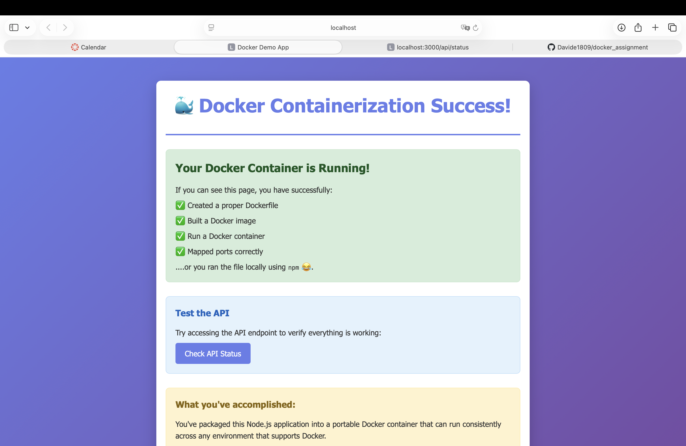
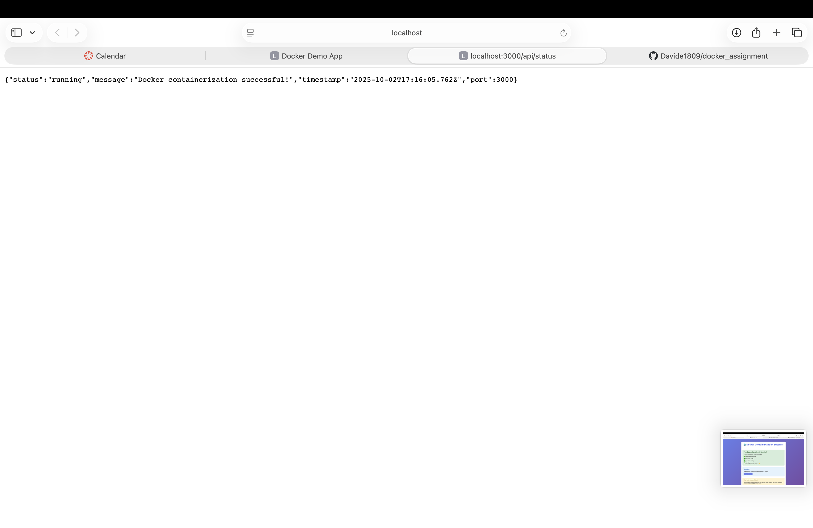

# Assignment #4: Application Containerization

This is a simple Node.js web application designed for learning Docker containerization concepts.

## Application Overview

This application is a basic Express.js web server that:
- Serves a static HTML page at the root (`/`)
- Provides an API status endpoint at `/api/status`
- Includes a health check endpoint at `/health`
- Runs on port 3000 by default (configurable via PORT environment variable)

## What's Included

- **app.js**: Main application server file
- **package.json**: Node.js dependencies and project configuration
- **public/index.html**: Static HTML page that confirms successful containerization
- **public/style.css**: Styling for the web page

## Running Without Docker (for reference only)

If you wanted to run this application directly (not required for assignment):
```bash
npm install
npm start
```

## Your Docker Assignment

**DO NOT MODIFY THE APPLICATION CODE**

Your task is to containerize this existing application using Docker. You need to:

1. Create a `Dockerfile` that properly containerizes this Node.js application
2. Build a Docker image from your Dockerfile
3. Run a container from your image
4. Verify the application works by accessing it in your browser

## Starting the Application

- To build the docker image run the command:

```bash
docker build -t my-node-app .
```

- To run your docker container in port 3000 run the command:

```bash
docker run -d -p 3000:3000 my-node-app

```
## Screenshots

- Application running at `http://localhost:3000`  
  

- API response at `http://localhost:3000/api/status`  
  

## Reflection Question
**Answer the following question in the space below**: How does containerization with Docker differ from using virtual machines, and why might a development team choose Docker containers over VMs for deploying applications like the one you just containerized?

Docker containers differ from virtual machines (VMs) because containers share the host operating system’s kernel, while VMs require a full guest operating system to run on top of a hypervisor. This makes containers much lighter, faster to start, and more resource-efficient compared to VMs.  

A development team might choose Docker containers over VMs because:  
- **Speed:** Containers launch in seconds, while VMs can take minutes to boot.  
- **Efficiency:** Containers use fewer resources since they don’t need a full OS.  
- **Consistency:** Containers package the app and its dependencies, eliminating the “works on my machine” problem.  
- **Portability:** The same container can run on any machine with Docker installed, regardless of the underlying OS.  
- **Scalability:** Containers are well-suited for cloud environments and microservices, where applications need to scale quickly.  

For deploying an application like this Node.js app, Docker provides a lightweight, consistent, and easily deployable solution that improves both development and production workflows.

## Application Requirements for Docker

Your Dockerfile should ensure:
- The application has Node.js runtime available
- All application files are copied into the container
- Dependencies are installed (`npm install`)
- Port 3000 is exposed
- The application starts with `npm start`
- The container can be accessed from your host machine

## Verification

When your Docker container is running correctly:
- Navigate to `http://localhost:3000` (or whatever port you mapped)
- You should see a success page confirming containerization worked
- The `/api/status` endpoint should return JSON status information

## Troubleshooting Tips

- Make sure your port mapping is correct in the `docker run` command
- Check that all files are copied into the container
- Verify Node.js dependencies are installed in the container
- Use `docker logs <container-name>` to see application output

## File Structure Expected
```
docker-assignment/
├── Dockerfile          # You create this
├── app.js              # Provided
├── package.json        # Provided
├── public/             # Provided
│   ├── index.html      # Provided
│   └── style.css       # Provided
└── README.md           # This file
```

Good luck with your Docker containerization!